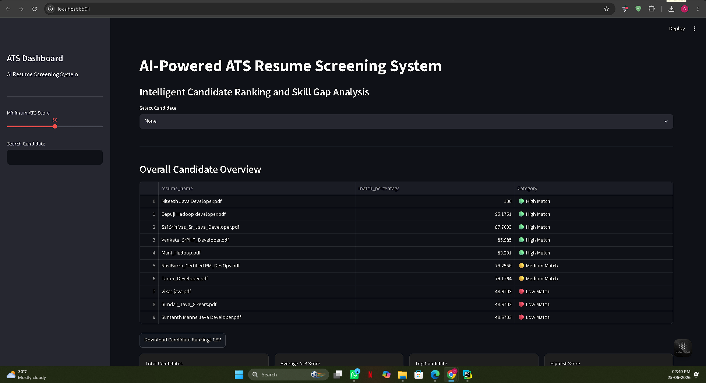
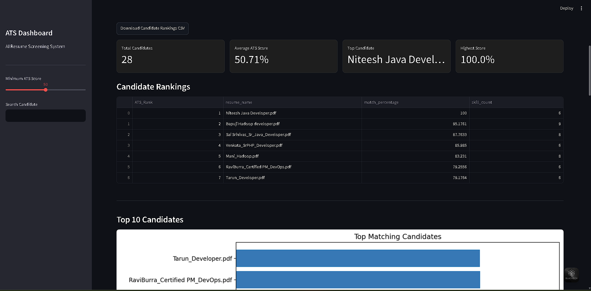
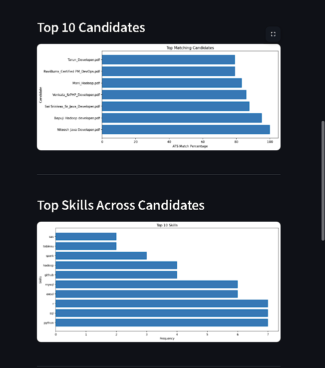
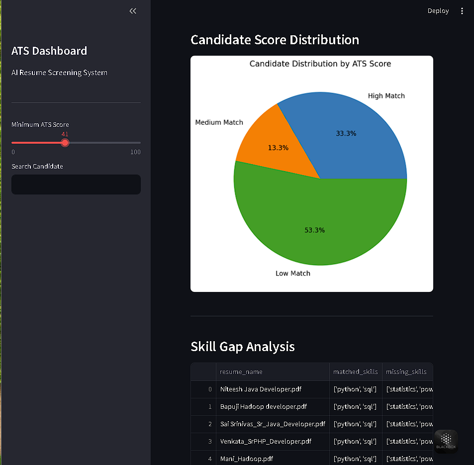
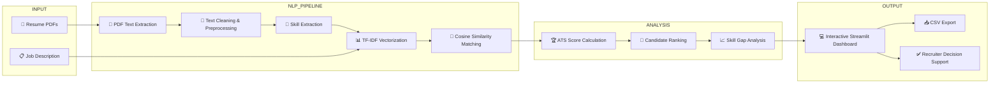

<h1 align="center">
🤖 AI-Powered ATS Resume Screening & Candidate Ranking System
</h1>

<p align="center">
An intelligent Applicant Tracking System (ATS) built with <b>Natural Language Processing (NLP)</b>, <b>Machine Learning</b>, and <b>Streamlit</b> to automate resume screening, candidate ranking, and skill gap analysis.
</p>

<p align="center">


</p>

---

# 📌 Project Overview

Recruiters often spend only a few seconds reviewing each resume, making manual screening both time-consuming and inconsistent. This project addresses that challenge by providing an AI-powered Applicant Tracking System (ATS) capable of automatically analyzing resumes, comparing them against job descriptions, and ranking candidates based on their relevance.

The application leverages **Natural Language Processing (NLP)** techniques such as **text preprocessing**, **TF-IDF vectorization**, and **Cosine Similarity** to measure how closely a candidate's resume matches the required job description. It also performs **skill extraction**, identifies **missing skills**, and presents the results through an intuitive **Streamlit dashboard**.

The primary objective of this project is to simplify the recruitment process by reducing manual effort, improving screening consistency, and helping recruiters identify the most suitable candidates more efficiently.

---
# ✨ Key Features

<table>
<tr>
<td width="50%">

### 📄 Resume Parsing
- Extracts text from PDF resumes
- Cleans and preprocesses resume content
- Supports multiple candidate resumes

</td>

<td width="50%">

### 🤖 NLP Processing
- Text preprocessing and tokenization
- TF-IDF vectorization
- Cosine Similarity matching

</td>
</tr>

<tr>
<td width="50%">

### 📊 Candidate Ranking
- Calculates ATS match percentage
- Ranks candidates automatically
- Identifies High, Medium and Low matches

</td>

<td width="50%">

### 🎯 Skill Gap Analysis
- Detects missing skills
- Compares resume with job description
- Highlights improvement areas

</td>
</tr>

<tr>
<td width="50%">

### 📈 Interactive Dashboard
- Built using Streamlit
- Candidate search
- ATS score filtering
- CSV download support

</td>

<td width="50%">

### ⚡ Machine Learning Pipeline
- Resume Parsing
- Feature Extraction
- TF-IDF Matching
- Candidate Ranking
- Skill Gap Analysis

</td>
</tr>
</table>

---

## 🖥️ Dashboard Overview

<p align="center">

</p>

<p align="center">
<b>Main dashboard displaying candidate overview, ATS filtering, and search functionality.</b>
</p>

---

## 📊 Candidate Ranking Dashboard

<p align="center">

</p>

<p align="center">
<b>Automatically ranks candidates based on ATS score and displays key recruitment metrics.</b>
</p>
---

## 📈 Analytics Dashboard

<p align="center">

</p>

<p align="center">
<b>Visualizes top candidates, skill distribution, and recruitment insights.</b>
</p>

## 🎯 Skill Gap Analysis

<p align="center">

</p>

<p align="center">
<b>Highlights matched skills and missing skills for each candidate.</b>
</p>

---

<p align="center">
  
</p>

---

## ⚙️Technical Workflow

The following diagram illustrates the complete workflow of the AI-Powered ATS Resume Screening & Candidate Ranking System.



---

# 🛠️ Tech Stack

| Category | Technologies |
|-----------|--------------|
| Programming Language | Python |
| Machine Learning | Scikit-Learn |
| Natural Language Processing | NLTK, spaCy |
| Data Processing | Pandas, NumPy |
| Data Visualization | Matplotlib, Plotly |
| Web Framework | Streamlit |
| Development Environment | Jupyter Notebook, PyCharm |
| Version Control | Git & GitHub |

---


# 📂 Project Structure

```text
AI-ATS-Resume-Screening-System/
│
├── 📁 app/
│   └── 🐍 app.py                     # Main Streamlit application
│
├── 📁 jupyter_notebooks/
│   ├── 📓 01_Text_Extraction.ipynb
│   ├── 📓 02_NLP_Preprocessing.ipynb
│   ├── 📓 03_Skill_Extraction.ipynb
│   ├── 📓 04_Skill_Matching.ipynb
│   ├── 📓 05_Skill_Gap_Analysis.ipynb
│   ├── 📓 06_Data_Visualization.ipynb
│   └── 📓 07_Streamlit_Integration.ipynb
│
├── 📁 resume/
│   ├── 📂 sample_resumes/
│   ├── 📂 extracted_text/
│   └── 📂 processed_data/
│
├── 📁 screenshots/
│   ├── 🖼️ dashboard_overview.png
│   ├── 🖼️ candidate_ranking.png
│   ├── 🖼️ analytics_dashboard.png
│   ├── 🖼️ skill_gap_analysis.png
│   └── 🖼️ workflow_diagram.png
│
├── 📁 docs/
│   ├── 📄 AI_ATS_Project_Report.pdf
│   └── 📄 AI_ATS_Project_Presentation.pdf
│
├── 📄 README.md
├── 📄 requirements.txt
└── 📄 LICENSE
```

---

# 📈 Project Highlights

- Resume Parsing using Natural Language Processing
- TF-IDF based Resume Matching
- Cosine Similarity Candidate Scoring
- Automatic ATS Ranking
- Skill Gap Identification
- Candidate Search & Filtering
- Interactive Streamlit Dashboard
- Download Results as CSV

---

# 🔮 Future Scope

- Multi-language Resume Support
- OCR Support for Scanned Resumes
- Deep Learning Based Resume Matching
- Resume Recommendation System
- Recruiter Authentication Portal
- Cloud Deployment (AWS / Azure)
- Large Language Model (LLM) Integration
- AI Interview Recommendation Engine

---

## 📜 License

This project is developed for educational and academic purposes as part of the Bachelor's Degree in Data Science & Business Analytics.

© 2026 Chaitanya Dhavale. All Rights Reserved.

⭐ If you found this project useful, consider giving it a star!


